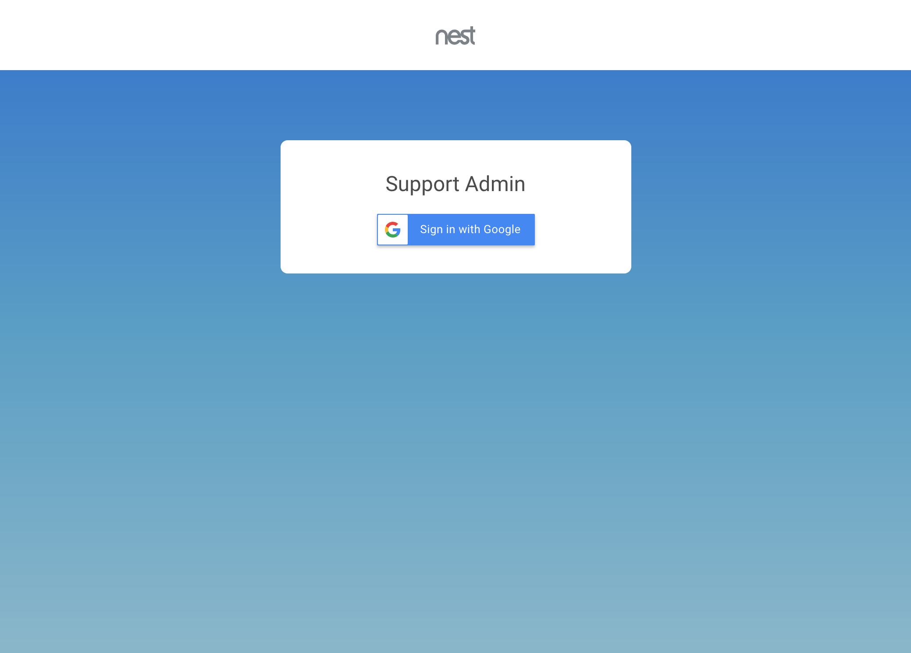
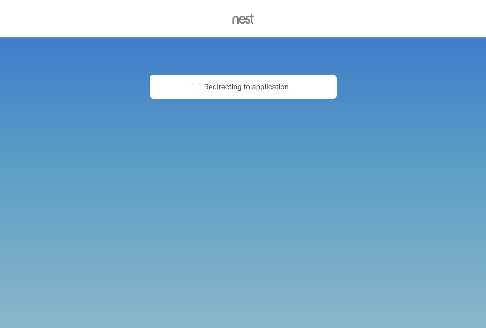
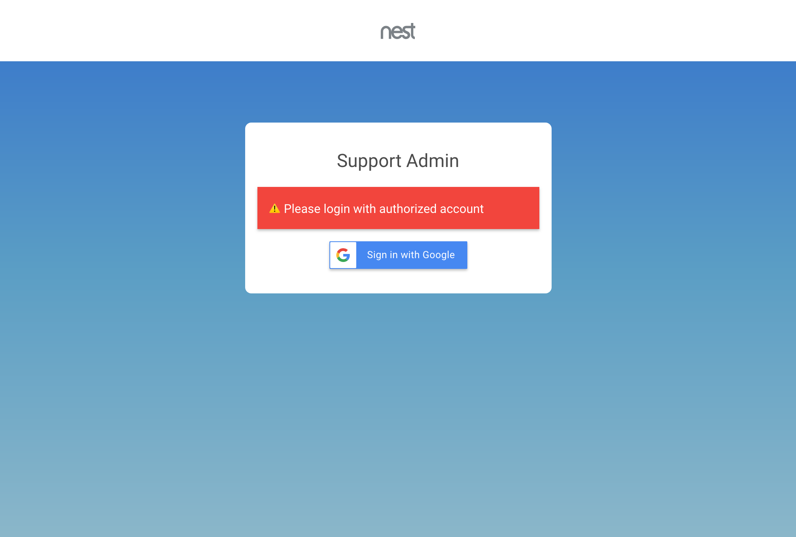
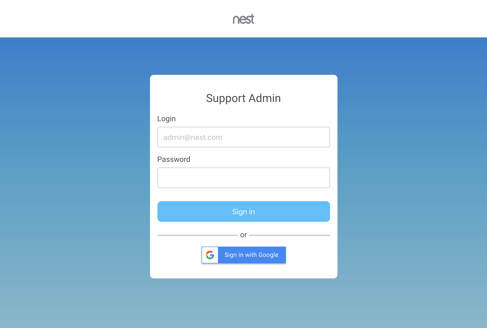

# UI redesign challenge

For my redesign I partially used background from Nest main site, its logo, spinner, and tried to follow color pallette in general. My initial concept with the same functionality as the old version looks like this:

[https://roadhump.github.io/nxxx/index.html]()

For mobile and frames new UI will look as:

For now, when user clicks "Sign in", it will open redirect message, simulate successful authorization.

Form can also return error if authorization failed. Try this link to check it, error will appear after "Sign in" click.
[https://roadhump.github.io/nxxx/index.html?showErrorOnSubmit=1]()

I was really not satisfied that this page contains so little functionality, so I added a login form in case it will be  necessary to allow login-password authorization. This form supports validation and shows progress indicator on submit.
[https://roadhump.github.io/nxxx/index.html?showLoginForm=1]()

